<!-- _class: lead -->

# Своя ML-модель автодополнения внутри плагина IntelliJ

## Go (`idea-golang-support`), C# (`idea-dotnet-support`) и общий движок `idea-ml-completion`

Три слоя: n-граммная LM → listwise-ранкер списка → собственный трансформер для подсказки целой строки.
Всё — Kotlin/JVM внутри плагина, без облака, без чужих моделей, без нативных рантаймов.

<span class="src">Все числа — из CHANGELOG.md (e01–e18), docs/*.md и eval-файлов репозитория; источник указан в заметках к каждому слайду.</span>

<!--
Источники: README.md, CLAUDE.md, CHANGELOG.md e01–e18, docs/NEURAL-RU.md, docs/NN-COMPLETION-API.md, docs/NATIVE-KERNELS.md,
docs/NN-FORMAT.md, docs/NN-PARITY.md, docs/MAC-CHECK-RU.md, tools/psi/REPORT.md, tools/roslyn/REPORT.md, models/README.md,
~/work/ml-data/{go,csharp}/nn/eval-*.md и metrics.jsonl прогонов.
-->

---

## О чём доклад

1. Задача и ограничения
2. Данные: корпуса, фильтры, два токенизатора
3. Слой 1 — n-граммная LM (32 MB, 5-граммы)
4. Слой 2 — ранкер списка автодополнения на реальных списках плагина
5. Слой 3 — собственный трансформер 31 M / 50 M с fill-in-the-middle
6. Как мы это измеряем: harness, пороги, token healing, учителя, fresh-наборы
7. Инференс в IDE: int8-формат, Kotlin и нативные ядра, KV-кэш, политика показа
8. Инструменты и дисциплина экспериментов
9. Что дальше

---

## Задача: две вещи, которые должен делать плагин

<div class="two">
<div>

### Серая подсказка целой строки

```go
_, err :=⟨курсор⟩
```
→ ` ic.getAerospikeVersion(node)`

Показать только когда уверены; остальное время — молчать.

</div>
<div>

### Ранжирование списка автодополнения

Список строит плагин по PSI — все кандидаты корректны по типам.
ML только переставляет: нужное — наверх.

Go, реальные списки: правила плагина top-1 **0.388**, ранкер **0.710**.

</div>
</div>

Третий сценарий, бонус: текст внутри строковых литералов (сообщения логов, format-строки, struct-теги).

<!-- Источники: docs/NEURAL-RU.md §1; CHANGELOG e17 (top-1 0.388 правила / 0.710 ранкер); пример — eval-go31m-e2-dump.md. -->

---

## Ограничения, которые определили конструкцию

| Ограничение | Следствие |
|---|---|
| Никаких сторонних предобученных моделей (Qwen, llama-family…) | модель обучается с нуля на своём корпусе |
| Никаких нативных рантаймов (llama.cpp, ONNX) в плагине | инференс — свой Kotlin в `ml-core`; опционально свои ~100 KB C-ядер |
| От пользователя ничего не требовать (нет правок `vmoptions`) | JBR не содержит `jdk.incubator.vector` — production-путь скалярный Kotlin |
| Без preview-API в `ml-core` (FFM в JBR 21 — preview) | веса в off-heap `ByteBuffer`, mmap |
| Ничего не покидает машину | нет сети в рантайме; корпус и модели — только на сервере и в GitHub |

Проверено: `--add-modules=jdk.incubator.vector` в vmoptions **ломает запуск IDE** (JBR 25.0.3).

<!-- Источники: CLAUDE.md «Hard constraints»; docs/NEURAL-RU.md §2; README «Constraints». -->

---

## Почему не «как у JetBrains»

- Full Line Code Completion в GoLand/Rider — нативный llama.cpp, поставляемый вместе с IDE, флаги JVM в product-level vmoptions.
- Плагину это недоступно: он живёт внутри чужой JVM и не может менять её опции.
- Отсюда: модель должна быть **маленькой** (31–50 M параметров, int8 файл 31–50 MB), а инференс — на CPU, в бюджете
  «строка из 20 токенов ≤ 150 мс, первая подсказка на холодном файле ≤ 1 с на 8-ядерном ноутбуке».

<!-- Источник: docs/NEURAL-RU.md §2, §5 (бюджет латентности). -->

---

<!-- _class: lead -->

# 2. Данные

---

## Корпус: все репозитории GitHub ≥ 20★, не форки, > 300 KB

| | Go | C# |
|---|---|---|
| Каталог (`tools/corpus/enumerate.py`) | 38 085 строк, 34 215 неархивных | 42 579 строк, 38 156 неархивных |
| Скачано (source-only снимки HEAD: `*.go`/`*.cs` + LICENSE/README) | 34 229, ~190 GB | 38 150, 113 GB |
| Скорость загрузки (codeload-tarballs, 32 потока) | ~170 MB/s, весь каталог ~25 мин | |
| После `prepare` (фильтры + dedup) | 4.69 млн файлов, 32.7 GB, **5.81 G** лексерных токенов | 6.06 млн, 34.5 GB, **4.22 G** |
| Фолды lm / rank / test (репозиториев) | 22 620 / 11 309 / 300 | 25 234 / 12 616 / 300 |

Фолды детерминированы по md5 имени репозитория: первые 300 → test, каждый третий из остальных → rank, прочие → lm.
LM, ранкер и оценка **никогда не делят репозиторий** (cross-fitting, см. e07).

<!-- Источники: catalog/*.jsonl (подсчёт строк), CLAUDE.md «Data», ~/work/ml-data/{go,csharp}/prepared/stats.json (prepare 2026-10-07), README «Data pipeline». -->

---

## Лицензии: MIT и Apache доминируют, у четверти C# лицензии нет

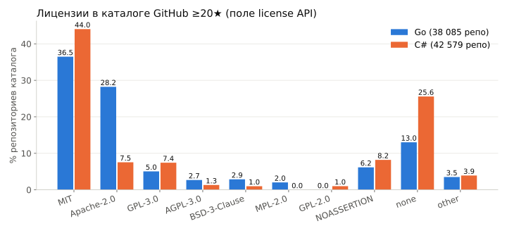

<!-- Источник: подсчёт поля `license` в ~/work/ml-data/catalog/go-20.jsonl (38 085 строк) и csharp-20.jsonl (42 579); «none» = null в API, NOASSERTION = нестандартная. -->

---

## `ml-train prepare`: что отбрасывается

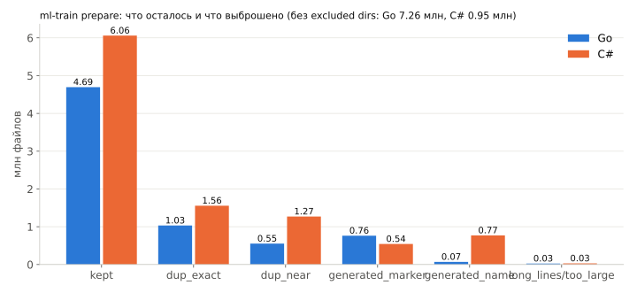

- Исключённые каталоги (`vendor`, `testdata`, `third_party`, `PackageCache`…) не читаются вовсе: Go — 7.26 млн файлов / 101 GB.
- Дубликаты: точные по хэшу токенов + близкие MinHash/LSH по множеству идентификаторов (Jaccard ≥ 0.8). Go 25 %, C# 32 % кандидатов.
- Генерированный код: маркер `Code generated … DO NOT EDIT` / `<auto-generated` **в строке комментария**, имена `*.designer.cs`, EF-миграции, Verify-снапшоты.

<!-- Источник: stats.json обоих языков; CHANGELOG e05 (dedup), e14 (маркер в комментарии), e15 (C#-фильтры v2). -->

---

## Чистка секретов перед кодированием (`tools/nn/clean`)

- Аудит lm-фолдов нашёл **реальные утечки**: облачные ключи, JWT, пароли в DSN, приватные ключи — в основном в тестовых фикстурах.
- Политика: файл с секретом выбрасывается (0.39 % байт Go / 0.16 % C#), значения заменяются (0.013 % / 0.017 %).
- Первая Go-модель `go31m-e1` обучалась **до** фильтра — не опубликована; все модели с e18 — на очищенных шардах.
- Строки и комментарии при этом в корпусе остаются: подсказка внутри литерала — отдельный сценарий.

<!-- Источник: CHANGELOG e16 «Corpus»; models/README.md (почему go-nn-31m-e1 не опубликована). -->

---

## Два токенизатора под два слоя

<div class="two">
<div>

### Лексер (n-граммы, ранкер)

- Свои лексеры Go и C# в `ml-core/lex`.
- Строки → `<STR>`, числа → `<NUM>`, комментарии невидимы.
- Словарь идентификаторов с капом 50 k, редкие → `<ID>` (~21 % идентификаторов в Go OOV).
- Шарды: `id << 2 | atLineEnd << 1 | lineStart` — 4 байта/токен, 23 GB на 5.8 G токенов.

</div>
<div>

### Byte-level BPE 16 384 (нейромодель)

- Свой тренер (Python) и энкодер (Kotlin), без сторонних библиотек.
- Претокенизатор `go-code-1`: `\n` + отступ — один претокен; буквы/цифры/пунктуация не склеиваются (`int32` → `int 3 2`); camelCase не режется.
- id 0–255 — байты, последние 16 — спец-токены (`<|fim_prefix|>`, `<|file_sep|>`…).
- Go: 3.16 байт/токен; 32k сэкономил бы лишь 3.8 % токенов за ×2 embedding.

</div>
</div>

<!-- Источники: CHANGELOG e14 (шарды), e16 «Tokenizer»; docs/NEURAL-RU.md §3.3, §4. -->

---

## Паритет BPE Kotlin ↔ Python — обязательное условие

- 10 571 кейс: 571 синтетический (пустой ввод, CRLF, NUL, невалидный UTF-8, эмодзи/ZWJ, BOM, строки 5 000 символов, литеральный `<|endoftext|>`) + 10 000 файлов test-фолда.
- 21.66 млн id совпали, round-trip побайтно точный.
- Kotlin-энкодер ~84 MB/s в один поток.
- Большая фикстура (31 MB) вне репо (`CML_BPE_FIXTURE`), маленькая (0.28 MB) — в `ml-core/src/test/resources/bpe`.
- Словарь C# обучен отдельно: Go-словарь на C# даёт 3.92 байта/токен (+7 % токенов).

<!-- Источник: docs/NEURAL-RU.md §4; CHANGELOG e16. -->

---

<!-- _class: lead -->

# 3. Слой 1 — n-граммная LM

---

## Модифицированный Kneser–Ney, порядок 5, на полном корпусе

- `PartitionedNgramTrainer`: словарь делится на 64 бина по первому токену; один проход шардов на бин собирает таблицы, считает continuation-counts, прунит SRILM-стилем, спиллит выживших.
- Go: 3.9 G токенов, 24 потока, ~85 GB heap, **11–12 минут**; 223 M различных 5-грамм, 105 M 4-грамм, 34 M 3-грамм.
- Пороги `--min-count 1,2,5,8,8 --min-repos 1,1,10,40,60`: n-грамма из одного репозитория — шум на чужом коде.
- Pruning исправлен в e03: оценка из полных счётчиков, backoff-вес пересчитывается так, что распределение по-прежнему суммируется в 1 (есть тест).

| Go e14 | n-грамм | размер | ppl | top-1 |
|---|---|---|---|---|
| e14-a, пороги e12 | 33.1 M | 207 MB | 3.8 | 0.525 |
| **e14-b** | 5.5 M | **32 MB** | 4.1 | 0.521 |
| e14-d | 4.4 M | 23 MB | 4.3 | 0.520 |

<!-- Источник: CHANGELOG e03, e14. -->

---

## Компактное хранение: 45 → 19 MB без потерь (e02)

- `CompactFloatMap`: open addressing по 64-битному хэшу n-граммы, в слоте — **24-битный fingerprint** (индекс слота фиксирует остальные биты) + **8-битный индекс** в 256 квантильных бинов.
- На диске: дельта слота (varint) + 3 + 1 байта на запись. Коллизии ≈ 1e-7 на lookup.
- Go: 45.1 → 18.6 MB, ppl 8.3 → 8.3, top-1 0.335 → 0.333, MRR ранкера 0.715 → 0.715.
- Точная `LongFloatMap` остаётся для обучения; `NgramModel.write` конвертирует.

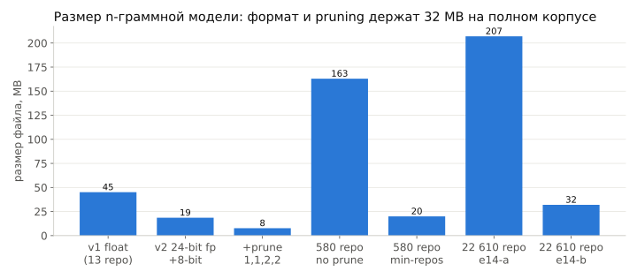

<!-- Источник: CHANGELOG e02 (формат v2), e03, e11, e14 (размеры). -->

---

## Кэш файла λ=0.3 — самый большой выигрыш в n-граммном слое (e04)

- `CacheLm` (порядок 3, absolute discounting по уже увиденным токенам файла) + `MixedLm`: P = λ·P_cache + (1−λ)·P_global.
- «Localness of software» (Tu, Su & Devanbu 2014); в IDE кэш кормится из буфера редактора, ~1 µs на токен.

| Go (13 репо, файловый сплит) | без кэша | λ=0.3 | λ=0.5 |
|---|---|---|---|
| perplexity | 8.3 | **5.0** | 4.9 |
| top-1 / top-5 идентификатора | 0.333 / 0.522 | **0.471 / 0.707** | 0.490 / 0.717 |
| MRR ранкера | 0.715 | **0.773** | 0.768 |

λ=0.5 лучше для «сырой» LM, λ=0.3 — для ранкера; стандарт измерений — 0.3.

<!-- Источник: CHANGELOG e04. -->

---

## Честные числа: сплит по репозиториям, не по файлам (e05)

- Файловый сплит был оптимистичен: при held-out **репозиториях** OOV идентификаторов утраивается (Go 8.9 → 29.4 %, C# 18.4 → 26.5 %), MRR ранкера −0.06.
- LM-only baseline падает сильнее (0.72 → 0.55), чем ранкер (0.77 → 0.71): признаки «внутри файла» переносятся на новые репо, глобальная LM — нет.
- e07: LM, обученная на тех же репо, что и ранкер, **портила** ранкер (0.712 → 0.683) — `lm_global_logprob` завышен на знакомых файлах. Лечение — cross-fitting (LM на 2/3 репо, ранкер на 1/3).
- С e05 стандарт измерения: сплит по репозиториям, dedup 0.8, cache λ=0.3, 300 held-out репо на полных корпусах.

<!-- Источник: CHANGELOG e05, e07. -->

---

## Perplexity n-грамм по экспериментам

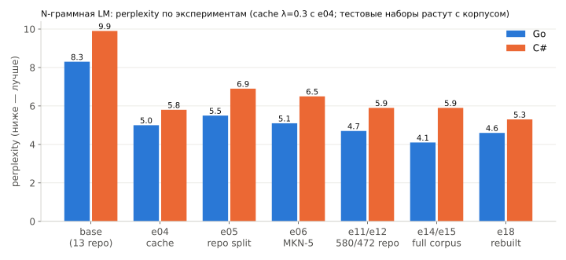

<!-- Источник: CHANGELOG baseline, e04, e05, e06 (MKN-5), e11/e12, e14/e15, e18 («CPU models rebuilt»). Тестовые наборы меняются с масштабом корпуса (13 → 30 → 300 репо), сравнение индикативное. -->

---

## MKN против Jelinek–Mercer, порядок 4 против 5 (e06)

| Go, repo split, cache 0.3 | размер | ppl | top-1 / top-5 | MRR |
|---|---|---|---|---|
| MKN order 4 | 30 MB | 5.5 | 0.440 / 0.682 | 0.712 |
| JM order 4, λ=0.5 | 29 MB | 6.1 | 0.450 / 0.685 | 0.710 |
| JM order 5 | 59 MB | 5.5 | 0.446 / 0.688 | 0.713 |
| **MKN order 5** | 61 MB | **5.1** | 0.448 / 0.689 | 0.716 |

- Литературный результат «JM-6 бьёт KN-3 на Java» на наших данных не воспроизвёлся: правильно оценённый MKN лучше на 0.5–0.6 ppl.
- Порядок 5 на 19 репо не стоил своих 2× размера; на 580 (e12) — уже стоил (ppl 5.1 → 4.7, +1.6 п.п. top-1, +7 MB).

<!-- Источник: CHANGELOG e06, e12. -->

---

## Что n-граммы умеют как inline-подсказка (e13/e14)

| Go, e14-b, показ при conf ≥ | показано | ≥ 3 токена верно | точность токенов |
|---|---|---|---|
| 0.7 | 16.5 % | 83.3 % | — |
| **0.8** | **10.0 %** | **92.9 %** | 0.956 |

- Остаток строки (≤ 8 токенов) целиком: 35.1 %; первый токен 0.652. C# e15-a: 3.1 % при 87.9 %, остаток 31.5 %.
- Что получается: идиомы `err != nil { return err }`, закрывающие скобки, `{ get; set; }`, `[Fact] public void X() {`.
- Что нет: начало оператора (не n-граммный вопрос), **арность** — `Color.FromArgb(r, g, b` → `, <NUM>`: 5-грамма не знает, сколько аргументов.
- ~1 мс на шаг (argmax по 50 k словарю).

Сегодня n-грамма — признак `lm_logprob` ранкера и запасной inline-режим; целую строку собирает трансформер.

<!-- Источник: CHANGELOG e13, e14 (inline), e15 (качественный разбор). -->

---

<!-- _class: lead -->

# 4. Слой 2 — ранкер списка автодополнения

---

## Что такое список и чем его ранжировать

- Список строит плагин: Go — `GoCompletionContributor`, C# — `NativeCSharpCompletion` / `NativeCSharpMemberCompletion`. В среднем **48 кандидатов**, до 100 в выборке.
- Ранкер — линейный, listwise: `score = w · x`, обучение минимизирует `−log softmax(w·x)[chosen]` по списку, L2 1e-4, 10 эпох (`LinearRanker.kt`).
- Схема признаков (`FeatureSchema.kt`): 13 общих + языковой блок (Go 17, C# 19), каждый блок **конъюнкция с видом контекста** (6 видов: после `.`, начало оператора, аргумент, позиция типа, правая часть `=`, прочее) → Go 30 × 7 = **210 весов**.
- Хэш схемы хранится в модели: модель одной схемы отказывается оценивать векторы другой (training/serving parity).
- Бюджет в IDE: < 5 мс на 500 кандидатов — O(кандидаты × порядок) hash-lookup'ов.

<!-- Источник: ml-core/.../rank/FeatureSchema.kt, LinearRanker.kt; docs/ADAPTER.md §4; CHANGELOG e10, e17. -->

---

<!-- _class: dense -->

## 13 общих признаков — из текста и статистики, без PSI

| признак | смысл |
|---|---|
| `lm_logprob` | n-грамма log P(кандидат \| контекст) с кэшем файла |
| `lm_global_logprob` | то же без кэша — модель сама взвешивает «локальное vs глобальное» |
| `file_freq_log`, `recency_log`, `is_most_recent` | сколько раз и как давно встречался в файле |
| `prefix_case_match`, `upper_initial`, `name_len`, `in_vocab` | форма имени и набранный префикс |
| `list_size_log`, `lm_rank_log`, `lm_delta_best`, `freq_rank_log` | относительные по списку (после скоринга всех кандидатов) |

Языковой блок Go (адаптер): группы вида (`kind_local/param/field/method/func/type/package/keyword`), уровень области видимости, `needs_import`,
совпадение с ожидаемым типом, объявлен в файле + расстояние, порядок правил плагина как `rule_rank_log`.

Правило адаптера: генератор примеров (офлайн, headless) и weigher в IDE считают признаки **одним и тем же кодом**; паритетный тест обязателен.

<!-- Источник: FeatureSchema.kt (BASE), docs/ADAPTER.md §2–4, CHANGELOG e07, e10. -->

---

## Proxy-списки против реальных: почему синтетика не переносится

- До e10 ранкер учился на **proxy-списках**: кандидаты сэмплированы из словаря вокруг истинного токена.
- На proxy-тесте всё хорошо (Go MRR 0.759, C# 0.756). На **реальных** списках плагина proxy-ранкер даёт 0.518 — **хуже правил плагина (0.527)**.
- Причина: у proxy-списка нет PSI-структуры (виды, scope, ожидаемый тип); ранкер не видел ни одного настоящего распределения кандидатов.
- Вывод e17: ранкер плагина обучается только на реальных списках. C#-ранкер e15 (proxy) — отладочный, переобучается в e18.

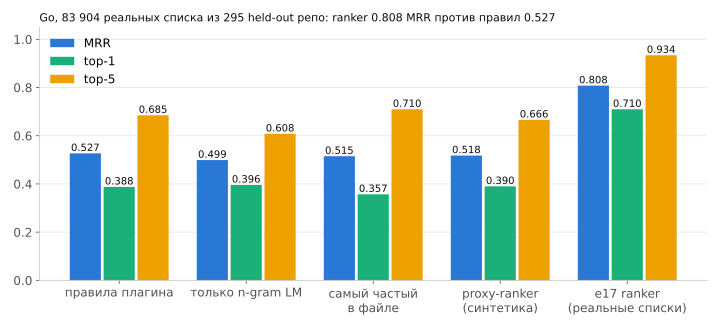

<!-- Источник: CHANGELOG e14/e15 (proxy MRR), e17 (таблица на 83 904 списках). -->

---

## Как достать реальные списки: headless IDE на сервере

- IntelliJ IDEA Community 2026.1.4 распакована в `/root/work/idea`, JBR как `JAVA_HOME`, Go 1.27.1, `fontconfig` (headless-редактор всё равно просит шрифт).
- Export — JUnit-класс плагина `GoMlDatasetExport` (`./gradlew :go-psi-ide:mlDataset`); ≤ 120 файлов на репо, 10 позиций на файл, префикс 0–2 символа, ≤ 100 кандидатов, ответ = токен из исходника.
- Однопоточный → 10 JVM с командной строкой Gradle test worker'а и раздельными sandbox-каталогами: 595 репозиториев за ~26 мин, 27 мс на позицию.
- Плагин показывает список в 65–66 % позиций (29 % — имена объявлений и т. п.), ответ есть в списке в **88.6–88.9 %** (recall плагина).

| фолд | репо | файлов | позиций | списков | кандидатов/список |
|---|---|---|---|---|---|
| rank | 300 | 20 970 | 204 497 | 119 723 | 48.1 |
| test | 295 | 14 794 | 144 507 | 83 904 | 46.3 |

<!-- Источник: CHANGELOG e17; tools/psi/GO-HEADLESS-EXPORT.md. -->

---

## Находка: в корпусе не было `go.mod`

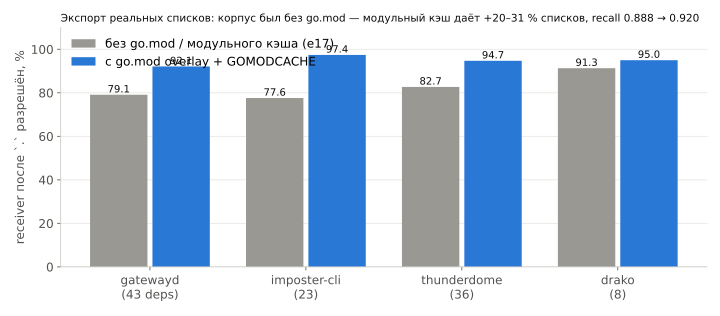

- `fetch.sh` хранил только `*.go` + LICENSE/README → в e17 **каждый внешний импорт был неразрешён**.
- Лечение: `go.mod/go.sum` докачиваются в overlay (`prepare-mods.sh`), зависимости — в `GOMODCACHE` вне IDE.
- Индексы GOROOT/модулей ничего не дают (completion берёт типы из PSI, не из stub-индекса); цена — +15–20 % на позицию.

<!-- Источник: tools/psi/REPORT.md (таблицы по gatewayd и трём репозиториям). -->

---

## По видам контекста и по весам

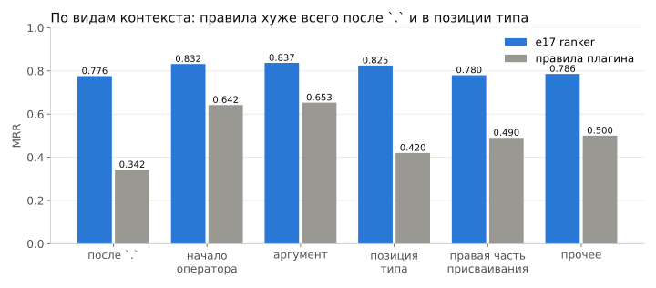

<!-- Источник: CHANGELOG e17, «Per context kind». -->

---

## Самые тяжёлые веса — то, что правила тоже «знают», но не умеют взвесить

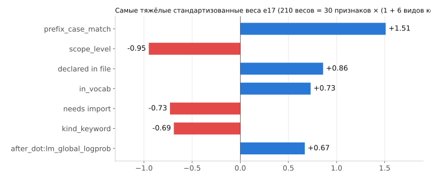

Обучение: 55 с на 119 723 списках; e10 (7 репо) → e17 (300 репо): MRR 0.783 → 0.808 на тесте в 10× больше.

<!-- Источник: CHANGELOG e17 («Heaviest standardised weights», время обучения). -->

---

## C#: экспорт реальных списков идёт сейчас (e18)

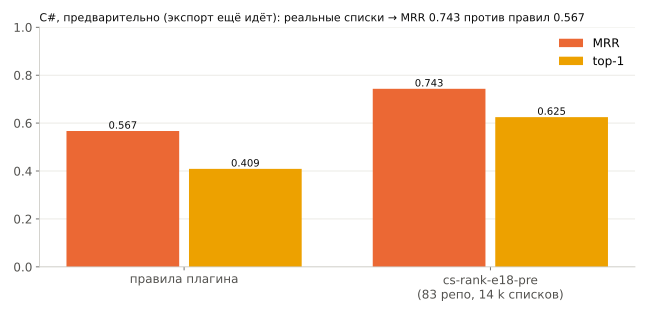

- Плагин .NET: `CSharpMlFeatures` (19 языковых признаков), Gradle-задача `mlDataset`; экспорт в 16 git-worktree, ~0.7 репо/мин
  (экспортёр копирует и индексирует весь репозиторий; остаток — `solutionTypes`-скан на позицию).
- Предварительный ранкер на 83 репо / 14 k списков: MRR **0.743** / top-1 0.625 против правил 0.567 / 0.409. Финальные числа — после экспорта.

<!-- Источник: CLAUDE.md, раздел «2026-10-07 evening» (preliminary e18 ranker), commit b078ea6. -->

---

<!-- _class: lead -->

# 5. Слой 3 — собственный трансформер

---

## Архитектура: Llama-стиль, минимум операций для Kotlin

```
x  = tok_emb[ids]                                  # tied: lm_head = tok_emb^T
for each of L layers:
    x += Wo · Attn( RoPE(Wq·n), RoPE(Wk·n), Wv·n ),   n = RMSNorm(x)      # GQA, causal, no bias
    x += W2 · ( SiLU(W1·m) ⊙ W3·m ),                m = RMSNorm(x)      # SwiGLU
logits = RMSNorm_final(x) · tok_emb
```

| выбор | почему |
|---|---|
| pre-norm **RMSNorm**, eps 1e-5 | одна операция, без mean/bias |
| **RoPE** rotate-half (GPT-NeoX/HF), θ = 10 000, inv_freq в f32 | таблицы cos/sin в Kotlin; формат документирует именно rotate-half |
| **GQA**: 8 Q-голов / **2 KV-головы** | KV-кэш на CPU: f32 на 2048 токенов 16.8 MB вместо 67 MB при MHA |
| **head_dim 64** везде | удобные тайлы для C-ядер и SDPA; GQA через `enable_gqa` |
| **SwiGLU** ffn ≈ 8/3·d (1408 при d512) | стандарт Llama, без bias |
| **tied embeddings** | −8.4 M параметров (27 % файла) при vocab 16 384 |

<!-- Источник: tools/nn/train/model.py (докстринг и код), docs/NN-FORMAT.md «Model semantics», docs/ARCHITECTURE-REVIEW-RU.md. -->

---

## Пресеты и цена

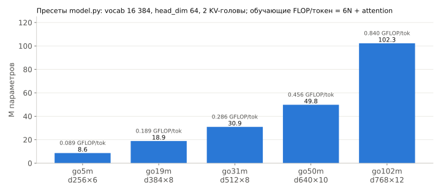

Выбор размера решил бенчмарк инференса на случайных весах, не априорная цифра. Контекст 2048 (медиана файла 1 023 BPE-токена, 74.5 % токенов — в файлах длиннее окна).

<!-- Источник: `python tools/nn/train/model.py` (таблица пресетов, GFLOP/tok = 6N + 12·L·d·T), docs/NEURAL-RU.md §5–6. -->

---

## Почему 31 M и 50 M: бюджет латентности на ноутбуке

| конфигурация (NnBench, случайные веса, 512 токенов + 20, 8 потоков, EPYC) | scalar Kotlin: строка | native q8: строка | при наборе (reuse 8) |
|---|---|---|---|
| S 30 M | 148 мс | **46 мс** | 39 / 16 мс |
| M 48 M | 208 мс | **67 мс** | 53 / 21 мс |
| L 99 M | 534 мс | 122 мс | 100 / 37 мс |

- Бюджет: строка ≤ 150 мс, холодный файл ≤ 1 с. Скалярно укладывается только 30 M; с нативными ядрами — 50 M; 100 M требует сжатия контекста или следующего рефакторинга ядер.
- Решение 2026-10-07: репозиторий несёт **обе** модели на язык (31 M по умолчанию, 50 M опционально), переключатель в плагине — позже.

<!-- Источник: docs/NATIVE-KERNELS.md «End to end» (строки S/M/L при 8 потоках), docs/NEURAL-RU.md §5, CLAUDE.md «Decisions 2026-10-07». -->

---

## Fill-in-the-middle: модель видит код после курсора

```
plain:    <|file_sep|> path\n  tokens  <|endoftext|>
FIM PSM:  <|fim_prefix|> <|file_sep|> path\n pre <|fim_suffix|> suf <|fim_middle|> mid <|endoftext|>
FIM SPM:  <|fim_prefix|> <|fim_suffix|> suf <|fim_middle|> <|file_sep|> path\n pre mid <|endoftext|>
```

- FIM на уровне документа с вероятностью 0.7; PSM/SPM 50/50; заголовок с путём всегда при префиксе (имя GitHub-репо намеренно **не** включено — плагин его не знает).
- Границы: середина ≤ 256, суффикс ≤ 512, префикс — хвост, чтобы документ ≤ 2040 токенов.
- Срезы: 50 % токенные (длина U[0,32] или U[0,256]); 50 % **выровнены по строкам** — середина кончается в конце строки, k строк (k=1 в половине случаев, иначе 1+Geom(0.35) ≤ 8), начало — начало строки или случайный токен внутри (курсор посреди строки).
- Инференс: `<|fim_prefix|><|fim_suffix|> suffix <|fim_middle|> header prefix`, стоп на `<|endoftext|>` / переводе строки.

<!-- Источник: tools/nn/train/data.py (докстринг), tools/nn/train/README.md «FIM». -->

---

## Баг, который стоил 62 % эпохи: упаковка резала FIM-документы

- go31m-e1 на шаге 2500: PSM — **2 %** верных строк при 62 % у SPM и plain.
- Причина не формат, а нарезка: документы склеивались в плоский поток и резались на окна 2048 где попало; 74.5 % токенов — в файлах длиннее окна, поэтому в PSM середина обычно оказывалась **без префикса** — модель научилась его игнорировать.
- Исправление (`data.py`): FIM-документ никогда не разрезается границей окна; если не помещается — укорачивается префикс (при ≥ 384 свободных токенов) или документ откладывается на следующее окно. Тесты: `<|fim_prefix|>` и `<|fim_middle|>` в одном окне, `pre+mid+suf == body`, точный resume.
- PSM восстановился до 56 %, но SPM (70 %) остался форматом инференса; следующий прогон — чисто, с `fim_rate 0.7`.

<!-- Источник: CHANGELOG e16 «FIM bug found and fixed mid-run»; docs/NEURAL-RU.md §6. -->

---

## PSM против SPM при 31 M: инференс только в SPM

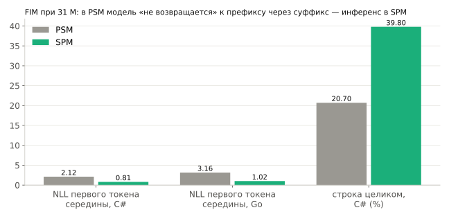

Даже при обучении с исправленным форматом с нуля (cs31m-e1) PSM не догнал: в 47 % случаев модель сразу выдаёт `<|endoftext|>`.
Teacher-forced NLL первого токена середины: PSM 2.12 против SPM 0.81 — эффект ёмкости/формата, не данных.

<!-- Источник: docs/NEURAL-RU.md §7b (NLL PSM/SPM C# 2.12/0.81, Go 3.16/1.02; строка целиком 20.7 vs 39.8 %). -->

---

## Упаковка данных: репозиторий как контекст

- **Понижающий вес больших репо**: файл репозитория с T_r токенами остаётся в эпохе с вероятностью `min(1, sqrt(2M / T_r))` — SDK-обёртка в 100× больше «колена» вносит 10×, а не 100×. SDK-репо падают с 0.9 % до 0.2 % потока.
- **Группировка по репозиторию**: файлы одного репо режутся на группы ≤ 2·seq_len, окно 2048 обычно содержит несколько файлов одного проекта — тот кросс-файловый контекст, который даст плагин.
- Без паддинга, без маски между документами, loss на каждом токене.
- I/O: `os.pread` (page fault на 13.7 GB memmap стоил ~20 мс, pread 0.2 мс), id путей кэшируются один раз; загрузчик ~16 M токенов/с в один поток.
- Детерминизм: состав эпохи и FIM-срезы из `numpy.default_rng([seed, epoch, …])`, состояние потока — в чекпойнте, resume точный (проверено: loss непрерывен на шаге 399 → 591).

<!-- Источник: tools/nn/train/README.md «Data pipeline decisions», data.py докстринг, CHANGELOG e16/e18 (smoke resume). -->

---

## Рецепт обучения

| параметр | значение |
|---|---|
| оптимизатор | AdamW (0.9, 0.95), weight decay 0.1 только на матрицах, grad clip 1.0 |
| lr | **2e-3**, warmup 500, cosine до 1e-4 (e1: 1e-3) |
| батч | **0.5 M токенов/шаг** (e1: 1 M), micro-batch 32 × 2048 |
| точность / компиляция | bf16 autocast, `torch.compile` |
| данные | 1 эпоха = Go 6.85 G / C# 5.65 G токенов (~220 токенов/параметр — далеко за Chinchilla) |
| железо | 2 × H200 NVL, DDP через `torchrun`: группы данных чередуются по рангу, rank 0 пишет чекпойнт с состоянием всех рангов |

Экспорт: int8 per-output-column (embedding тоже), нормы f32, конфиг в meta-блоке; `--check N` измеряет потерю от квантизации.

<!-- Источник: tools/nn/train/README.md, CHANGELOG e16 («Model»), e18 (lr2e3 recipe, DDP). -->

---

## Скорость: эпоха 31 M за 47 минут

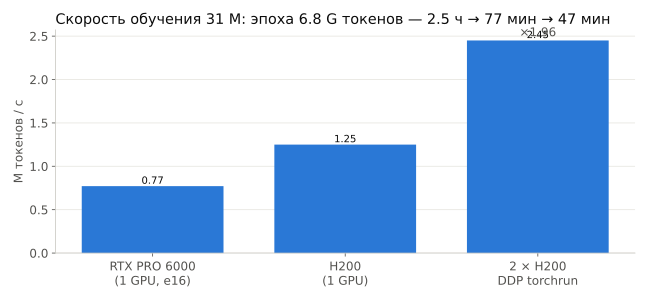

GPU без NVLink и P2P (VM): NCCL all_reduce через host memory ~28 GB/s — 62 MB bf16-градиентов go31m ≈ 2 мс/шаг, не мешает. Шаг 1 M токенов — 428 мс.

<!-- Источник: CHANGELOG e16 (771k tok/s PRO 6000), e18 (1.25 M на H200, 2.45 M DDP, ×1.96, 428 ms/step); CLAUDE.md (NCCL). -->

---

## Кривые обучения

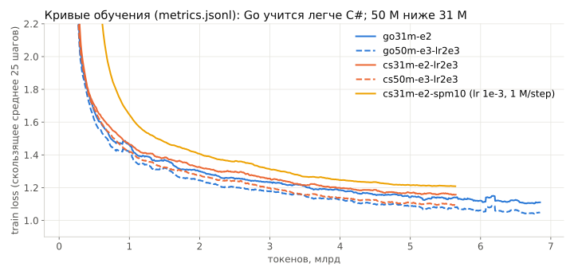

<!-- Источник: ~/work/ml-data/go/nn/{go31m-e2,go50m-e3-lr2e3}/metrics.jsonl, ~/work/ml-data/csharp/nn/{cs31m-e2-lr2e3,cs50m-e3-lr2e3,cs31m-e2-spm10}/metrics.jsonl; поле loss, скользящее среднее 25 шагов. -->

---

## Eval perplexity по ходу обучения

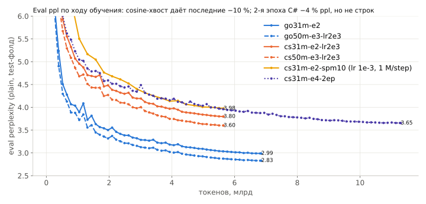

<!-- Источник: те же metrics.jsonl, поле eval_ppl (plain ppl на фиксированных окнах test-фолда); cs31m-e4-2ep — 2 эпохи, 11.3 G токенов. -->

---

## Абляции C#: что помогло и что нет

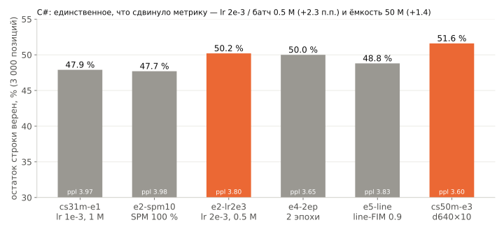

<!-- Источник: CHANGELOG e16 (cs31m-e1 47.9 % healed), e18 (spm10 47.7, lr2e3 50.2, 2ep 50.0, line 48.8, cs50m 51.6; ppl 3.97/3.98/3.80/3.65/3.83/3.60). -->

---

## Что НЕ помогло — с числами

| гипотеза | результат | вывод |
|---|---|---|
| SPM-доля 1.0 (не тратить ёмкость на PSM) | 47.7 % против 47.9 %, FIM-ppl 4.39 | ничего; PSM-способность теряется — оставляем 0.5 |
| 2 эпохи C# 31 M (11.3 G токенов, 83 мин) | ppl 3.80 → 3.65, но строки 50.2 → 50.0 %; fresh +1.9 п.п. | C# не ограничен данными при 31 M; не публикуем |
| Line-FIM (90 % середин — концы строк, 80 % одна строка) | 48.8 % против 50.2 % | дефолтный микс уже покрывает случай |
| Project bigram cache на декоде (биграммы по другим файлам репо, λ 0.05–0.2) | Go 63.6 → 63.4 %, C# 50.2 → 50.3 %; гейт схлопывается (43.8 → 20.3 % показов) | недостающие факты — не биграммной формы |
| Beam 4 | +0.9–1.6 п.п. за ×3.6 времени | только harness |

Стандартная ошибка на 3 000 позициях ≈ 0.9 п.п.: разницы < 2 п.п. — шум без парного сравнения.

<!-- Источник: CHANGELOG e18 (все пять пунктов); docs/ARCHITECTURE-REVIEW-RU.md (стандартная ошибка). -->

---

## Прокси-модель 8.6 M: гипотезы о данных за минуты

- Пресет `go5m` (d256 × 6, 8.6 M параметров, из них 4.2 M embedding), 1.5 G токенов, **20 минут** на прогон.
- Калибровка: та же пара «base vs line-FIM» на 8.6 M дала 40.2 % против 40.3 % — прокси верно предсказал «эффекта нет» для 31 M (50.2 vs 48.8).
- Рабочее правило с 2026-10-07: гипотезы о данных/формате — на прокси, победители — сразу в 50 M; 31 M больше не переобучаем.

<!-- Источник: CHANGELOG e18 «Proxy calibration»; CLAUDE.md. -->

---

## 31 M → 50 M: ёмкость даёт немного, Go — больше, чем C#

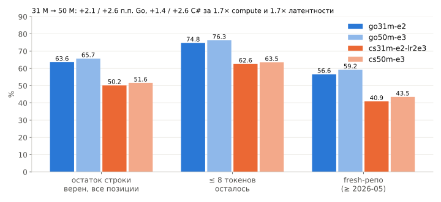

<!-- Источник: CHANGELOG e18 (go50m / cs50m абзацы), models/README.md. -->

---

<!-- _class: lead -->

# 6. Как мы это измеряем

---

## Harness `eval_inline.py`: тот же протокол, что у n-грамм

- 3 000 позиций в ~2 500 файлах test-фолда (каждый 50-й токен, seed 1), курсор после предыдущего токена строки; промпт ≤ 2000 токенов, ≤ 48 новых, greedy.
- Сравнение **лексическое**: остаток строки (без комментария) побайтно (`line exact`), `≤ 8` — только строки с 1–8 оставшимися токенами (критерий n-грамм), первый лексический токен, `norm` — строки/числа как `<STR>/<NUM>`.
- Уверенность = **произведение** вероятностей всех токенов строки вместе с переводом строки (`conf_prod`).
- Разрезы: вид позиции (после `.`, `(`, `,`, `=`, начало строки…), длина остатка, тест/не тест, внутри строкового литерала, тип «залеченного» остатка.
- Дополнительные наборы: 400 позиций «набран пробел», 400 «курсор внутри идентификатора», 85 «внутри строки».
- Паритет: Kotlin воспроизводит PyTorch 1000/1000 строк (см. §7) — числа harness'а переносятся на плагин.

<!-- Источник: CHANGELOG e16 «Whole-line evaluation»; ~/work/ml-data/go/nn/eval-go31m-e2.md (шапка и Caveats). -->

---

## N-граммы против трансформера того же размера файла, Go

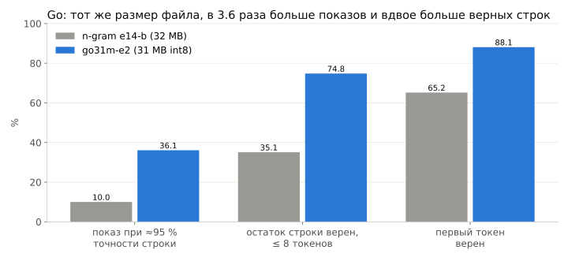

<!-- Источник: README «Results»; CHANGELOG e14 (n-gram 10.0 % / 35.1 % / 0.652), e18 (go31m-e2: prod ≥0.8 36.1 % при 97.0 %, ≤8 74.8 %, первый токен 0.881). -->

---

## То же для C#: язык труднее для обеих моделей

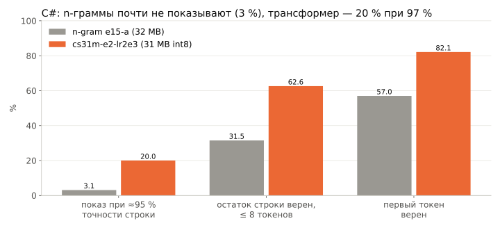

C#: строки длиннее (в среднем 8.1 лексических токена до конца против 6.5 в Go), больше свободного текста (`$"…"`, сообщения логгера), многословные типы.

<!-- Источник: CHANGELOG e15 (3.1 % / 31.5 % / 0.570), e18 (cs31m-e2-lr2e3: prod ≥0.8 20.0 % при 97.0 %, ≤8 62.6 %, первый токен 0.821); NEURAL-RU §7b (длина остатка). -->

---

## Порог показа: кривые «показано — точность»

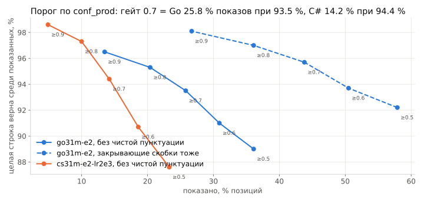

<!-- Источник: eval-go31m-e2.md и eval-cs31m-e2-lr2e3.md, раздел «spm: show policy», колонка both (без чистой пунктуации + защита от повторов) и none. -->

---

## Какую уверенность брать: произведение, не среднее

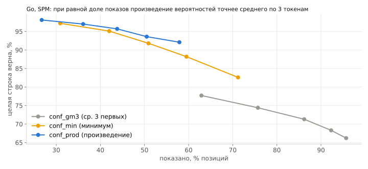

`conf_gm3` (среднее первых 3 токенов, аналог n-грамм) переуверено для целых строк; `conf_prod` калибруется монотонно:
корзина 0.9–1.0 → 96 % верных строк, 0.5–0.6 → 61–66 %, < 0.1 → 3 %.

<!-- Источник: eval-go31m-e2.md «spm: thresholds for the three confidence definitions»; NEURAL-RU §7b (калибровка C#). -->

---

## Token healing: курсор внутри BPE-претокена

- Протокол (и живой курсор) часто стоит **внутри** претокена: `foo(⟨⟩)`, `"x"⟨⟩)`, после набранного пробела, посреди идентификатора — 9.7 % позиций Go / 10.9 % C#; `()`, `");` — один претокен, модель такого обрыва в обучении не видела → 1.5–4.8 % верных строк там.
- Решение: промпт режется назад до последней границы претокена; байты между границей и курсором («набранный остаток») — **ограничение на декодирование**: словарь маскируется до токенов, начинающихся с остатка (или являющихся его префиксом), вероятности из маскированного softmax, остаток отрезается от результата.
- `VocabPrefixIndex`: отсортированный массив байтовых строк словаря + бинарный поиск, кэш по остатку — микросекунды.

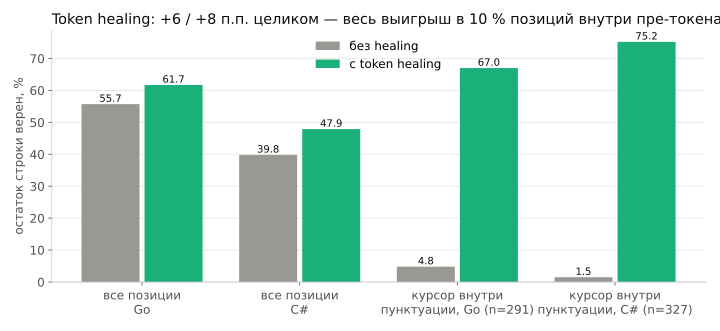

<!-- Источник: docs/NEURAL-RU.md §7c; docs/NN-COMPLETION-API.md. -->

---

## Правка после первого живого прогона в плагине: `WORD_EOL`

- Плагин Go 0.2.199–0.2.202: `return le⟨⟩` — курсор **после слова** сам является границей претокена, healing не срабатывал, модель продолжала «законченное» ` le` скобкой `(` (confProd 0.003–0.05).
- `healMode = WORD_EOL`: если после курсора только закрывающие/пробелы (ситуация набора), лечим от начала слова → остаток ` le` позволяет выбрать ` len` (P = 0.996), один ответ для `l`, `le`, `len`.
- Ещё два изменения из того же прогона: `trimClosersAfterCaret` (редактор парит скобки — хвост подсказки, повторяющий `)` после курсора, отрезается в движке) и гейт по умолчанию **0.7** вместо 0.8.
- На 3 000 тестовых позиций правила `BOUNDARY/WORD/WORD_EOL` различаются < 0.1 п.п. — harness такую ситуацию почти не сэмплирует; поэтому живой прогон и нужен.

<!-- Источник: CHANGELOG e18 «First live run of go-nn-31m-e2»; docs/NN-COMPLETION-API.md (healMode, trimClosersAfterCaret, таблица гейта). -->

---

## Fresh-набор: репозитории, созданные после выхода всех учителей

- Стандартный test-фолд **контаминирован** для учителей: Qwen2.5-Coder-7B воспроизвёл `buymeacoffee.com/<user>`-URL из тестового репо.
- `tools/nn/eval/fresh_manifest.py <lang> 2026-05-01 1000`: репозитории, созданные ≥ 2026-05-01, не в lm-фолде, ≥ 1 000 строк — C# 264 репо / 61 596 файлов, Go 481 / 129 918. 2 000 позиций.

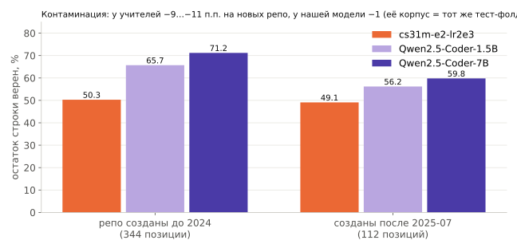

<!-- Источник: CHANGELOG e18 «Teacher ceiling» (контаминация, разбивка по дате создания на 500 стандартных позициях) и «Fresh-repository evaluation set». -->

---

## Потолок учителя: Qwen2.5-Coder на тех же позициях

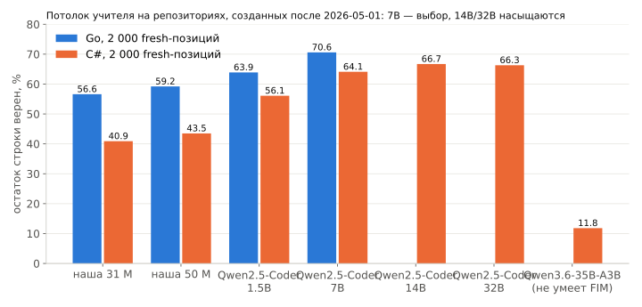

Учителя (`eval_hf.py`, HF-кэш 180 GB) **ничего не поставляют** в плагин — они измеряют запас для дистилляции. Qwen3.6-35B-A3B — не coder-base, FIM не делает (пустые середины).

<!-- Источник: CHANGELOG e18 (таблица fresh C#: 40.9/43.5/56.1/64.1/66.7/66.3/11.8; fresh Go: 56.6/59.2/63.9/70.6). -->

---

## Парный анализ: где именно выигрывает учитель

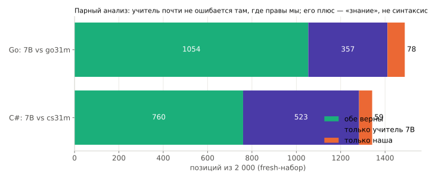

<!-- Источник: CHANGELOG e18: C# fresh «both 760, 7B only 523, ours only 59»; Go fresh «only teacher / only ours 357 / 78», both = 2000·0.566 − 78 = 1054 (выведено из line exact 56.6 %). -->

---

## Разрыв растёт с длиной остатка: «знание», не синтаксис

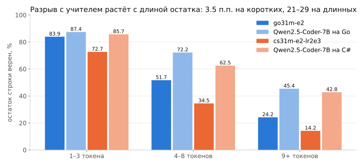

Ошибки учителя — те же, что и наши: имена, объявленные в других файлах, константы, литералы.

<!-- Источник: CHANGELOG e18 (fresh C#: rest 1–3 / 4–8 / 9+ = 72.7/34.5/14.2 ours vs 85.7/62.5/42.8 7B; fresh Go: 83.9/51.7/24.2 vs 87.4/72.2/45.4). -->

---

## По видам позиций

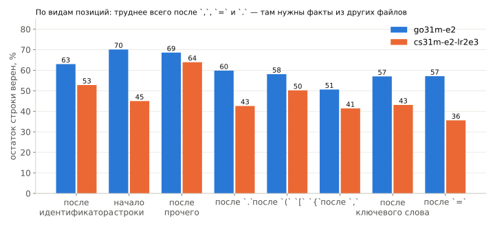

<!-- Источник: eval-go31m-e2.md и eval-cs31m-e2-lr2e3.md, «spm: breakdowns», группа kind, колонка line exact. -->

---

<!-- _class: dense -->

## Сырые примеры, Go (go31m-e2, SPM) — верные

```go
func mustWrite(t *testing.T, path, content string) {
	t.⟨⟩                                   TRUE: Helper()          GEN: Helper()       prod 1.00
```
```go
	s1 := NewSymbol("?cleartest"⟨⟩          TRUE: )                 GEN: )              prod 0.92  (healing: typed '"' → ')')
```
```go
	for i, actCtx := range ctxs {
		expCtx := c.Exp[i⟨⟩                 TRUE: ]                 GEN: ]              prod 0.82
```
```go
			_, err :=⟨⟩                    TRUE:  ic.getAerospikeVersion(node)
			require.Error(t, err)          GEN :  ic.getAerospikeVersion(tt.req)       prod 0.15 → не показано
```

Последний — класс «верная структура, чужое имя»: имя метода угадано из контекста файла, аргумент — нет; `conf_prod` 0.15 это и отражает.

<!-- Источник: ~/work/ml-data/go/nn/eval-go31m-e2-dump.md, раздел «confident & right». -->

---

<!-- _class: dense -->

## Сырые примеры, Go — уверенные и неверные

```go
		go func(id int) {
			defer func() { done <- struct{}{} }()
			⟨⟩                             TRUE: key := fmt.Sprintf("key-%d", id%10)
			_ = dc.PublishConfig(key, …)   GEN : for j := 0; j < 50; j++ {              prod 0.39
```
```go
		// Check if related_dataset_id exists
		_, err := c.⟨⟩                     TRUE: datasetStore.ByID(ctx, req.RelatedDatasetID)
		if err != nil {                    GEN : repoComponent.CheckRelatedDataset(ctx, req.RelatedDatasetID)   prod 0.03
```
```go
func setNamespace(obj *unstructured⟨⟩      TRUE: .Unstructured, namespace string) {
	if namespace == "" {                   GEN : .Unstructured) {                         prod 0.51
```

Классы ошибок: факт из другого файла (имя поля/метода), пропущенный параметр, правдоподобная, но чужая идиома. Синтаксически всё валидно.

<!-- Источник: eval-go31m-e2-dump.md, раздел «confident & wrong». -->

---

<!-- _class: dense -->

## Сырые примеры, C# (cs31m-e2-lr2e3)

```csharp
    #region Simple compilation tests
    ⟨⟩                                           TRUE: [Fact]        GEN: [Fact]            prod 0.90
    public void Round_trip_with_simple_catalogue()
```
```csharp
return this.PreviewImageService.PreviewCount -⟨⟩ TRUE:  1;           GEN:  1;               prod 0.61
```
```csharp
public LayoutConstraints WithMaxWidth(int maxWidth) =>
    this with⟨⟩         TRUE:  { MaxWidth = Math.Max(MinWidth, maxWidth) };   GEN:  { MaxWidth = maxWidth };   prod 0.51
```
```csharp
tooltipElement.AppendChild(prom.CreateTextNode(SentenceCase(⟨⟩
                        TRUE: elements.tooltip)));     GEN: tmpElements.tooltip)));     prod 0.94  — неверно, но уверенно
```
```csharp
_ctx.RoundedRect⟨⟩      TRUE: (new Rect(bounds.Position - new Vector2(2.0f), …), 3.0f);
                        GEN : (bounds.X - 4.0f, bounds.Y - 2.0f, bounds.Size.X + 8.0f, …   stop: limit, prod 0.01
```

Таблицы литералов (`{0, 2, 2, 7,15,15,…}`) — зацикливание; защита от повторов снимает 2.5–2.8 % строк, все неверные.

<!-- Источник: ~/work/ml-data/csharp/nn/eval-cs31m-e2-lr2e3-dump.md (confident & right / wrong); NEURAL-RU §7c (защита от повторов). -->

---

## Сколько добавил бы структурный контекст (PSI / Roslyn)

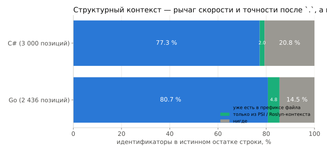

- Go (`GoMlContextExport`, 2 436 позиций): после `.` PSI даёт 12.7 % идентификаторов; тип qualifier'а известен в 41 % `.`-позиций (+23 % пакеты; остальное — внешние модули без кэша).
- C# (Roslyn-блок ≈ 250 BPE-токенов, ~150 мс/файл): «нужен и достаточен» лишь в 3 % позиций.
- Из «нигде» в Go 58 % — члены qualifier'а, типизированного позже в строке; 12 % — имена, объявленные в этой же строке.

<!-- Источник: CHANGELOG e17 (side result), tools/roslyn/REPORT.md §3. -->

---

## Roslyn-фильтр «разрешается ли сгенерированная строка?»

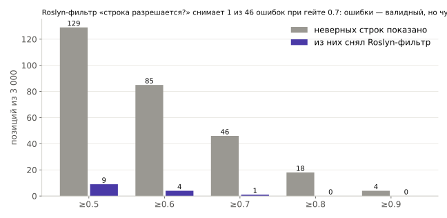

- Покрытие семантической модели подняли с 86.1 до 94.2 % (NuGet-ссылки отсутствовали; ~80 пакетов, `TypeIndex` для потерянных csproj-usings).
- При гейте 0.7 фильтр снимает **1 из 46** неверных строк и 18 верных (все там, где и истинная строка не разрешается). Остальные ошибки — валидный код, который автор просто не писал (`return pairs;` vs `Assert.NotEmpty(pairs);`).
- Вывод: страховочная сетка, не рычаг качества; headroom ≈ +0.1–0.5 п.п. точности.

<!-- Источник: tools/roslyn/REPORT.md §1–2. -->

---

<!-- _class: lead -->

# 7. Инференс в IDE

---

## Формат `.cml` (CMLN v1): mmap, int8, без сжатия

| поле | что |
|---|---|
| заголовок | `CMLN`, версия, meta `key=value` (vocabSize, dModel, nLayers, nHeads, nKvHeads, ffnDim, ropeTheta, normEps, tokenizerSha256, trainStep…) |
| директория | имя, dtype (f32 / int8+scales), ранг, dims, смещения — всё выровнено по 64 байтам |
| матрицы | `[in, out]` = `weight.T`, int8, **одна f32-шкала на выходной столбец**: `scale = max|col| / 127`, −128 не используется |
| `tok_emb` | `[dModel, vocab]` — у каждого токена своя шкала; служит и lookup'ом, и выходной головой |

- Потери квантизации: Go ppl 2.131 → 2.131, C# 3.966 → 3.967, go31m-e2 2.988 → 2.989, cs31m-e2 3.798 → 3.801.
- Загрузка: mmap 18–23 мс для 31 MB; на Windows mmap'нутый файл нельзя заменить — там читаем в direct buffer (~20 мс), `write` делает атомарный `Files.move`.
- Рантайм отказывается работать при несовпадении sha256 словаря.

<!-- Источник: docs/NN-FORMAT.md; CHANGELOG e16 (export lossless), e18 (int8 check, Windows fix); docs/NN-PARITY.md (mmap timing). -->

---

## Скалярный Kotlin — production-путь

- Веса остаются off-heap (mmap), активации — `FloatArray`.
- Циклы под авто-векторизацию C2: axpy по смещению 0, независимые аккумуляторы, без проверок границ — **~18 GMAC/s на ядро**.
- `NnExecutor`: пул потоков, регион = матрица × блок столбцов; ~45 регионов и ~400 вызовов ядра на токен декода.
- KV-кэш в `NnSession`: prefill досчитывает только после **наибольшего общего префикса** с прошлым промптом.
- Vector API удалён из `ml-core` 2026-10-07 — в JBR его нет; остались scalar и наши нативные ядра.

<!-- Источник: CHANGELOG e16 «Inference»; docs/NATIVE-KERNELS.md «Threading»; NN-COMPLETION-API.md (NnSession). -->

---

## Нативные ядра: ~1 100 строк C11, 4 бинаря по ~100 KB

| уровень ISA | инструкции | f32 GMAC/s/ядро | q8 GMAC/s/ядро |
|---|---|---|---|
| AVX2 + FMA | тайл 6×16 | 45–50 (≈ roofline) | 61–66 (`vpmaddubsw` sign trick) |
| AVX-512 / **VNNI** | 12×32 / 6×32, `vpdpbusd` | 50–53 | **178–211** (90–100 % roofline) |
| NEON / **DotProd** | 8×8 / 4×16, `sdot` | проверено на M1 Pro | проверено на M1 Pro |

- q8: активации int8 по блокам 128 входов с f32-шкалой, веса перепакованы в панели по 16 столбцов (один непрерывный поток по K — иначе GEMV головы прыгал по 128 KB и декод падал вдвое).
- Кросс-компиляция `zig cc`: linux-x64 84 KB, windows-x64 101 KB, macos-arm64 103 KB, macos-x64 91 KB.
- Загрузка из jar → `System.load` → `cml_abi_version` → **self-test на CPU пользователя** (каждое ядро против скалярного C-эталона) → любой сбой = Kotlin-ядра. `-Dcompletionml.nn.native=false` отключает.

<!-- Источник: docs/NATIVE-KERNELS.md (ISA levels, throughput, build, loading); docs/MAC-CHECK-RU.md. -->

---

## Латентность на обученной модели, сервер

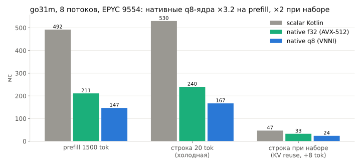

Декод: 1.98 → 1.50 → **1.06 мс/токен**. Профиль q8-prefill: сами ядра ≈ треть, остальное — копии heap↔native и Kotlin-glue (следующий шаг: активации целиком в native).

<!-- Источник: docs/NN-PARITY.md «Latency on the real weights» (go31m-e1, 8 потоков, медианы из 7); NATIVE-KERNELS.md (профиль). -->

---

## Латентность на MacBook Pro M1 Pro (NEON проверен 2026-10-07)

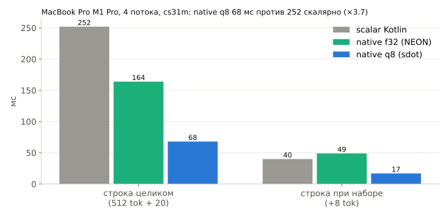

- `native: loaded libcmlkernels-macos-arm64.dylib, ISA neon-dotprod` — без вопросов Gatekeeper, self-test пройден.
- Паритет на Mac: scalar и native f32 — argmax 32/32, продолжения 32/32, rmse логпроб 0.0000; q8 — та же строка на 39/40 позициях.
- NEON f32 декодирует медленнее скаляра (2.28 vs 1.71 мс/токен) — не дефолт; `NnKernels.best()` сам выбирает q8.
- Решение: нативные ядра **поставляем**.

<!-- Источник: docs/MAC-CHECK-RU.md «Результаты», docs/NATIVE-KERNELS.md «macOS»; CLAUDE.md «Decisions 2026-10-07». -->

---

## Паритет Kotlin ↔ PyTorch на реальных весах

| ядра | эталон | max \|Δlogit\| | argmax | greedy-48 идентичны | та же строка (1000 позиций) |
|---|---|---|---|---|---|
| scalar Kotlin | fp32 fake-quantised | **0.0001** | 32/32 | 32/32 | **1000/1000** |
| native f32 | fp32 fake-quantised | **0.0001** | 32/32 | 32/32 | **1000/1000** |
| native q8 | fp32 fake-quantised | 0.36 | 32/32 | 26/32 | 957/1000 |
| scalar | float-модель (до int8) | 0.39 | 32/32 | 29/32 | — |

- Сама int8-квантизация весов стоит 0.26 логита в среднем; q8-активации — примерно столько же; расхождения — близкие ничьи, line exact не меняется (54.7 % vs 54.6 %).
- Фикстура: 32 промпта с логитами + 500 позиций × {plain, spm}; C#-фикстура `models/parity-cs` лежит в репо — проверка на любой машине за 3 мин.
- Паритет healing'а: 99/99 записей (остаток, промпт, текст, `confProd`, `show`).

<!-- Источник: docs/NN-PARITY.md (таблицы logit/behavioural parity, C# fixture); NEURAL-RU §7c «Паритет». -->

---

## Бюджет промпта: сколько контекста реально нужно

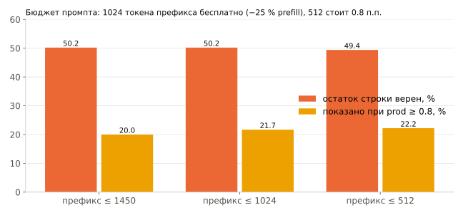

Дефолт `NnCompletion.Options`: `maxPrefix = 1024` (было 1450), `suffixTokens = 512` (256 стоило бы −0.6 п.п., 128 −1.7), `maxNew = 48`, префикс из последних 40 KB текста до начала строки.

<!-- Источник: CHANGELOG e18 (prefix 1024/512 на cs31m-e2-lr2e3), docs/NN-COMPLETION-API.md (Options defaults, suffix study). -->

---

## Политика показа (`NnCompletion.complete(path, before, after, session)`)

```kotlin
show = confProd ≥ 0.7 ∧ ¬(suppressPunctOnly ∧ punctOnly) ∧ ¬repeated ∧ text.isNotEmpty()
```

| гейт confProd | Go go31m-e2: показано / верно | C# cs31m-e2-lr2e3 |
|---|---|---|
| ≥ 0.6 | 30.9 % / 91.0 % | 18.5 % / 90.8 % |
| **≥ 0.7** | **25.8 % / 93.5 %** | **14.2 % / 94.4 %** |
| ≥ 0.8 | 20.4 % / 95.3 % | 10.0 % / 97.3 % |
| ≥ 0.9 | 13.5 % / 96.5 % | 4.9 % / 98.6 % |

- `punctOnly` (`);`, `}`, `)]`) — 24.5 % позиций Go, верны в 98.9 % при ≥ 0.8: показывать их — вопрос UX (IDE всё равно вставит); с ними Go при 0.7 = 43.8 % / 95.8 %.
- Защита от повторов: BPE n-грамма (n ≤ 4, ≥ 4 байт) трижды подряд → стоп и не показывать; бесплатна (снимает только неверные).
- Исключение `p(newline)` из произведения кривую не улучшает (−0.5–1 п.п. точности при равном показе).

<!-- Источник: docs/NN-COMPLETION-API.md (формула show, таблица гейта, punct-only); NEURAL-RU §7c. -->

---

## Память и прогрев

- RSS JVM бенчмарка 314–385 MB при `-Xmx2g` (базовая JVM 60–66 MB; heap 173–249 MB — KV-кэш + буферы активаций); mmap-веса — 31 MB page cache, q8-перепаковка — ещё ~31 MB native (39–45 мс один раз).
- KV-кэш одной сессии при GQA 2 головы: f32 на 2048 токенов 16.8 MB (вместо 67 MB при 8 головах).
- JIT: первая строка — 1.4 с скалярно / 0.37–0.57 с native → фоновый прогрев prefill'ом при старте плагина; со второй строки — steady state.
- `NnSession` — `AutoCloseable` (native KV-кэш), `Cleaner` подстрахует.

<!-- Источник: docs/NN-PARITY.md «Memory and load»; model.py (комментарий о KV-кэше), ARCHITECTURE-REVIEW-RU (16.8 vs 67 MB); NATIVE-KERNELS.md. -->

---

<!-- _class: lead -->

# 8. Инструменты и дисциплина

---

## Репозиторий `idea-ml-completion`

```
ml-core/        чистый Kotlin (stdlib, JDK 21, без preview-API) — встраивается в плагины как git subtree под ml/
    lex/ ngram/ rank/ bpe/ nn/ (nn/native: JNI-загрузчик со scalar-fallback) format/
native/         C11 SIMD-ядра, self-test, bench; `make cross` — 4 платформы через zig
ml-train/       Kotlin CLI: prepare, shard, l2 (LM), l1 (ранкер), eval-lm, eval-rank, eval-inline, bench-nn
tools/nn/       PyTorch: tokenizer/ train/ eval/ clean/ distill/ — только обучение
tools/psi/      headless-экспорт реальных Go-списков; tools/roslyn/ — Roslyn-фильтр и контекст для C#
tools/corpus/   каталог GitHub и параллельная загрузка;  tools/server/ — рецепты сервера
models/         опубликованные модели (31/50 M на язык, n-граммы, BPE, паритетные фикстуры)
docs/           NEURAL-RU, NN-FORMAT, NATIVE-KERNELS, NN-PARITY, NN-COMPLETION-API, ADAPTER, MAC-CHECK-RU, …
```

Плагины: `include(":ml-core")` из `ml/ml-core`; модели — обычные файлы в ресурсах (`<lang>-lm.cml`, `<lang>-rank.cml`, `<lang>-nn.cml` + `.bpe`);
после изменений движка `ml-core` синхронизируется в оба плагина.

<!-- Источник: README «Layout», docs/ADAPTER.md §1. -->

---

## Дисциплина экспериментов

- **Один эксперимент = один коммит**: запись `eNN` в CHANGELOG с таблицей измерений + строка в таблице README.
- Стандартное измерение зафиксировано: сплит по репозиториям, dedup 0.8, cache λ=0.3, cross-fitted фолды lm/rank/test, 300 held-out репо, 3 000 позиций harness'а.
- Модели — в репозитории (`models/`, 30–50 MB каждая), корпуса и чекпойнты — нет; GitHub — единственное долговременное хранилище.
- Что не измерялось — сказано явно (ARCHITECTURE-REVIEW-RU «Не измерено»: абляции глубины/ширины, GQA/MQA, разброс по сидам, латентность на x86-ноутбуке с обученной моделью).
- Параллельные агенты — в git worktree; долгие задачи — `systemd-run`, сессия — в `tmux`.

<!-- Источник: CLAUDE.md «Communication and conventions», README «Experiment log», docs/ARCHITECTURE-REVIEW-RU.md. -->

---

## Сервер и цена одного прогона

| | |
|---|---|
| машина | VM 32 vCPU, 235 GB RAM, 2 × H200 NVL 143 GB (без NVLink/P2P), диск 2 TB под корпус |
| `prepare` Go / C# | 19 / 29 мин (stats.json: 1 139 / 1 721 с) |
| n-граммная LM на полном корпусе | 11–12 мин, ~85–100 GB heap |
| BPE-словарь | ~5 мин на стратифицированной выборке 1.6 GB |
| трансформер 31 M, 1 эпоха, DDP | Go 49 мин, C# ~47–77 мин; 50 M — 62–89 мин |
| eval 3 000 позиций | ~5–20 мин на GPU |
| ранкер на 120 k списков | 55 с |

<!-- Источник: CLAUDE.md «This server»; stats.json (seconds); CHANGELOG e14/e15 (LM), e16 (BPE), e18 (эпохи, DDP), e17 (ранкер). -->

---

## Переустановка сервера 2026-10-07: всё на `/` потеряно, восстановлено за день

- Потеряно: манифесты, токенайзеры, шарды, модели e14/e15/e17, чекпойнты, Go-корпус (190 GB), IDEA, клоны плагинов. Выжил только диск `/mnt/corpus` с C#.
- Что спасло: `tools/corpus/fetch-catalog.sh` (Go-каталог за ~25 мин при 170 MB/s), `tools/server/rebuild-data.sh` (prepare → shard → BPE → encode для обоих языков), код обучения в `tools/nn/`, модели в `models/` на GitHub.
- Пересобрано в тот же день: n-граммы (Go ppl 4.6, C# 5.3 на новых фолдах), Go BPE-словарь (новый sha256 — старая go-nn-31m-e1 с ним несовместима), go31m-e2 (49 мин), затем cs/go 50 M.
- Не восстановлен: Go-ранкер e17 (нужен повторный экспорт реальных списков, ~2 ч) — в репо пока proxy-ранкер.
- Урок: всё, что имеет значение, пушится по мере готовности.

<!-- Источник: CLAUDE.md (разделы «REINSTALLED», «State 2026-10-07 afternoon»), CHANGELOG e18, models/README.md (go-rank-proxy). -->

---

<!-- _class: lead -->

# 9. Что дальше

---

## Дорожная карта (в порядке приоритета)

1. **Дистилляция из Qwen2.5-Coder-7B** (sequence-level): `tools/nn/distill/distill.py` сэмплирует FIM-позиции из шардов, учитель генерирует через vLLM, `train.py --teacher/--teacher-rate` подмешивает строки учителя как середины FIM. Запас: Go +14 п.п., C# +23 п.п. на fresh-наборах. Инструменты готовы, генерация идёт.
2. **Структурный контекст** в промпте (сигнатуры, члены типов из других файлов) — не ради recall (+2–5 %), а ради точности после `.` и скорости (контекст в 3–5 раз короче).
3. **Constrained decoding** по PSI-кандидатам после `.`: маска первого токена уже есть (`VocabPrefixIndex`) — достаточно подать список допустимых идентификаторов.
4. **GBDT-ранкер** + log-prob нейромодели как признак; C#-ранкер e18 на полном экспорте, затем weigher в плагине.
5. Переключатель **31 M / 50 M** в плагине; fine-tuning на коде организации (корпус + рецепт воспроизводимы из манифеста).
6. Инференс: активации целиком в native (убрать копии и диспетчеризацию), int4 для декода на ноутбуках.

<!-- Источник: CLAUDE.md «Next in the queue», «Plan»; commit c575d18 (distill tooling); CHANGELOG e18 (headroom, bigram cache → structure instead); NATIVE-KERNELS.md «Known gaps». -->

---

## Итоговые числа

| | Go | C# |
|---|---|---|
| корпус после фильтров | 4.69 млн файлов, 5.81 G токенов, 22 620 lm-репо | 6.06 млн, 4.22 G, 25 234 |
| n-грамма (32 MB) ppl / top-1 | 4.6 / 0.510 | 5.3 / 0.487 |
| ранкер на реальных списках: MRR / top-1 (правила) | **0.808 / 0.710** (0.527 / 0.388) | предв. **0.743 / 0.625** (0.567 / 0.409) |
| трансформер 31 M (int8 31 MB): ppl | 2.99 | 3.80 |
| остаток строки верен, все позиции / ≤ 8 токенов | **63.6 % / 74.8 %** | **50.2 % / 62.6 %** |
| гейт 0.7: показано / верно | 25.8 % / 93.5 % | 14.2 % / 94.4 % |
| 50 M: остаток строки | 65.7 % | 51.6 % |
| fresh-репо: наша 31 M / Qwen2.5-Coder-7B | 56.6 / 70.6 % | 40.9 / 64.1 % |
| строка 20 токенов, 8 потоков: scalar / native q8 | 530 / 167 мс (при наборе 47 / 24) | M1 Pro, 4 потока: 252 / 68 мс |
| паритет Kotlin ↔ PyTorch | 1000/1000 строк | 40/40 (фикстура в репо) |

<!-- Источник: stats.json; CHANGELOG e17, e18; NN-COMPLETION-API.md; NN-PARITY.md; MAC-CHECK-RU.md; CLAUDE.md (C# preliminary). -->

---

## Ссылки

- Движок: `github.com/dvislobokov/idea-ml-completion` — `CHANGELOG.md` (e01–e18 с измерениями), `docs/NEURAL-RU.md`, `models/`
- Плагин Go: `idea-golang-support` (ветка `migration`: ранкер за `-PmlEnabled=true`, inline-провайдер поверх `NnCompletion`)
- Плагин C#: `idea-dotnet-support` (экспорт списков `mlDataset`, inline-задача `ML_INLINE_TASK.md`)
- Проверить инференс на своей машине за 5 минут: `docs/MAC-CHECK-RU.md` (JDK 21, модель и фикстура в репо, сеть не нужна)

Спасибо. Вопросы?

<!-- Источник: README, docs/ADAPTER.md, docs/MAC-CHECK-RU.md, CLAUDE.md (состояние плагинов). -->
